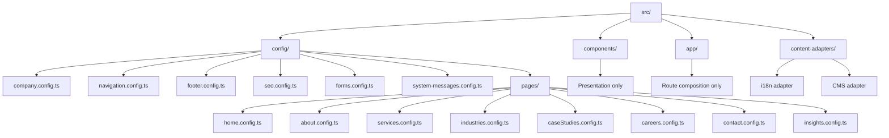

# Content Centralization Review

## 1. Architecture Review Report

### Executive Summary
The application is partially centralized today: most business/domain content already lives in data modules under src/data and global defaults under src/config/site.ts.

However, content ownership is inconsistent. A significant set of user-facing strings still exists inside pages/components, especially:
- section eyebrow labels
- form labels, placeholders, status/error strings
- fallback/404/500/loading copy
- route metadata fallback text
- breadcrumb labels and URL bases
- logo/footer/static framing copy

This prevents clean localization, creates duplication risk, and makes future CMS integration harder.

### Current Architectural State
- Strong foundation already exists with content-rich modules:
  - [src/data/homepageData.ts](src/data/homepageData.ts)
  - [src/data/about.ts](src/data/about.ts)
  - [src/data/services.ts](src/data/services.ts)
  - [src/data/industries.ts](src/data/industries.ts)
  - [src/data/caseStudies.ts](src/data/caseStudies.ts)
  - [src/data/jobs.ts](src/data/jobs.ts)
  - [src/data/contactInfo.ts](src/data/contactInfo.ts)
  - [src/data/contactFaqs.ts](src/data/contactFaqs.ts)
  - [src/data/articles.ts](src/data/articles.ts)
  - [src/data/offices.ts](src/data/offices.ts)
- SEO defaults are centralized in [src/config/site.ts](src/config/site.ts) and consumed by [src/lib/seo/metadata.ts](src/lib/seo/metadata.ts).
- Multiple components remain hybrid (props + hardcoded framing copy), breaking presentation-only design.

### Architectural Gaps
- Mixed ownership between src/data, src/config, app pages, and components.
- Repeated constants (site URL, breadcrumb labels, CTA copy) in route files.
- Form UX content is embedded in components and validation schemas.
- Error state content is embedded in route-level files.
- No explicit content schema boundary prepared for i18n/CMS adapters.

---

## 2. Complete Hardcoded Content Audit

### 2.1 Findings by Requested Category

1. Hardcoded text in pages
- Found in:
  - [src/app/error.tsx](src/app/error.tsx)
  - [src/app/not-found.tsx](src/app/not-found.tsx)
  - [src/app/loading.tsx](src/app/loading.tsx)
  - [src/app/insights/category/[category]/page.tsx](src/app/insights/category/[category]/page.tsx)
  - [src/app/insights/tag/[tag]/page.tsx](src/app/insights/tag/[tag]/page.tsx)
  - [src/app/insights/[slug]/page.tsx](src/app/insights/[slug]/page.tsx)

2. Hardcoded text in components
- Found in 30 component files (detailed list in section 3 and section 6).

3. Hardcoded CTA labels
- Found in:
  - [src/components/careers/JobApplyCTA.tsx](src/components/careers/JobApplyCTA.tsx)
  - [src/components/careers/JobHero.tsx](src/components/careers/JobHero.tsx)
  - [src/app/insights/[slug]/page.tsx](src/app/insights/[slug]/page.tsx) (Insights CTA usage)
  - [src/components/sections/CallToActionSection.tsx](src/components/sections/CallToActionSection.tsx) (supporting sentence)

4. Hardcoded navigation labels
- Primary nav labels are centralized now in [src/data/homepageData.ts](src/data/homepageData.ts), but ownership should move to navigation config.
- Breadcrumb labels remain hardcoded in pages:
  - [src/app/services/page.tsx](src/app/services/page.tsx)
  - [src/app/services/[slug]/page.tsx](src/app/services/[slug]/page.tsx)
  - [src/app/careers/page.tsx](src/app/careers/page.tsx)
  - [src/app/careers/[slug]/page.tsx](src/app/careers/[slug]/page.tsx)
  - [src/app/insights/page.tsx](src/app/insights/page.tsx)
  - [src/app/insights/[slug]/page.tsx](src/app/insights/[slug]/page.tsx)

5. Hardcoded hero content
- Found in hero/support sections:
  - [src/components/about/AboutHero.tsx](src/components/about/AboutHero.tsx)
  - [src/components/sections/HeroSection.tsx](src/components/sections/HeroSection.tsx)
  - [src/components/insights/InsightsHero.tsx](src/components/insights/InsightsHero.tsx)
  - [src/components/careers/JobHero.tsx](src/components/careers/JobHero.tsx)

6. Hardcoded section titles
- Found in many section wrappers:
  - [src/components/sections/TrustIndicatorsSection.tsx](src/components/sections/TrustIndicatorsSection.tsx)
  - [src/components/sections/LocationsSection.tsx](src/components/sections/LocationsSection.tsx)
  - [src/components/sections/ServicesPreviewSection.tsx](src/components/sections/ServicesPreviewSection.tsx)
  - [src/components/sections/WhyChooseUsSection.tsx](src/components/sections/WhyChooseUsSection.tsx)
  - About components with fixed eyebrow labels.

7. Hardcoded service descriptions
- Mostly centralized in [src/data/services.ts](src/data/services.ts).
- Remaining hardcoded service framing text exists in:
  - [src/components/sections/ServicesPreviewSection.tsx](src/components/sections/ServicesPreviewSection.tsx)

8. Hardcoded about page content
- Core about copy is centralized in [src/data/about.ts](src/data/about.ts).
- But about framing labels remain in components:
  - [src/components/about/AboutHero.tsx](src/components/about/AboutHero.tsx)
  - [src/components/about/Timeline.tsx](src/components/about/Timeline.tsx)
  - [src/components/about/CoreValues.tsx](src/components/about/CoreValues.tsx)
  - [src/components/about/Credentials.tsx](src/components/about/Credentials.tsx)
  - [src/components/about/LeadershipSection.tsx](src/components/about/LeadershipSection.tsx)
  - [src/components/about/OfficePresence.tsx](src/components/about/OfficePresence.tsx)
  - [src/components/about/TrustCounters.tsx](src/components/about/TrustCounters.tsx)
  - [src/components/about/VisionMission.tsx](src/components/about/VisionMission.tsx)
  - [src/components/about/AboutCTA.tsx](src/components/about/AboutCTA.tsx)

9. Hardcoded contact information
- Centralized in [src/data/contactInfo.ts](src/data/contactInfo.ts), [src/data/offices.ts](src/data/offices.ts), [src/config/site.ts](src/config/site.ts).
- But static contact rendering strings still appear in [src/components/layout/Footer.tsx](src/components/layout/Footer.tsx) and [src/components/contact/OfficeCard.tsx](src/components/contact/OfficeCard.tsx).

10. Hardcoded office addresses
- Centralized in [src/data/offices.ts](src/data/offices.ts).
- No major page/component address hardcoding beyond static location summary in footer.

11. Hardcoded footer content
- Found in:
  - [src/components/layout/Footer.tsx](src/components/layout/Footer.tsx)
  - [src/components/ui/LogoPlaceholder.tsx](src/components/ui/LogoPlaceholder.tsx)

12. Hardcoded FAQs
- FAQ content is centralized in [src/data/contactFaqs.ts](src/data/contactFaqs.ts).
- No major FAQ copy hardcoded inside FAQ renderer.

13. Hardcoded careers content
- Major content centralized in [src/data/jobs.ts](src/data/jobs.ts).
- Hardcoded careers UI text remains in:
  - [src/components/careers/ApplicationForm.tsx](src/components/careers/ApplicationForm.tsx)
  - [src/components/careers/JobApplyCTA.tsx](src/components/careers/JobApplyCTA.tsx)
  - [src/components/careers/JobHero.tsx](src/components/careers/JobHero.tsx)

14. Hardcoded blog content
- Blog/article content is centralized in [src/data/articles.ts](src/data/articles.ts).
- Hardcoded blog UI framing remains in:
  - [src/components/insights/ArticleContent.tsx](src/components/insights/ArticleContent.tsx)
  - [src/components/insights/FilterPanel.tsx](src/components/insights/FilterPanel.tsx)
  - [src/components/insights/SearchBar.tsx](src/components/insights/SearchBar.tsx)
  - [src/components/insights/NewsletterCTA.tsx](src/components/insights/NewsletterCTA.tsx)
  - [src/components/insights/InsightsHero.tsx](src/components/insights/InsightsHero.tsx)

15. Hardcoded metadata content
- Partially centralized via data + createPageMetadata.
- Hardcoded metadata/fallback strings still found in:
  - [src/app/about/page.tsx](src/app/about/page.tsx)
  - [src/app/services/[slug]/page.tsx](src/app/services/[slug]/page.tsx)
  - [src/app/careers/[slug]/page.tsx](src/app/careers/[slug]/page.tsx)
  - [src/app/insights/[slug]/page.tsx](src/app/insights/[slug]/page.tsx)
  - [src/app/insights/category/[category]/page.tsx](src/app/insights/category/[category]/page.tsx)
  - [src/app/insights/tag/[tag]/page.tsx](src/app/insights/tag/[tag]/page.tsx)

---

## 3. Files Requiring Refactoring

### 3.1 Pages and Route Files
- [src/app/about/page.tsx](src/app/about/page.tsx)
- [src/app/careers/[slug]/page.tsx](src/app/careers/[slug]/page.tsx)
- [src/app/services/[slug]/page.tsx](src/app/services/[slug]/page.tsx)
- [src/app/insights/[slug]/page.tsx](src/app/insights/[slug]/page.tsx)
- [src/app/insights/category/[category]/page.tsx](src/app/insights/category/[category]/page.tsx)
- [src/app/insights/tag/[tag]/page.tsx](src/app/insights/tag/[tag]/page.tsx)
- [src/app/error.tsx](src/app/error.tsx)
- [src/app/not-found.tsx](src/app/not-found.tsx)
- [src/app/loading.tsx](src/app/loading.tsx)
- [src/app/layout.tsx](src/app/layout.tsx)

### 3.2 Components with Hardcoded Display Text
- [src/components/about/AboutCTA.tsx](src/components/about/AboutCTA.tsx)
- [src/components/about/AboutHero.tsx](src/components/about/AboutHero.tsx)
- [src/components/about/CoreValues.tsx](src/components/about/CoreValues.tsx)
- [src/components/about/Credentials.tsx](src/components/about/Credentials.tsx)
- [src/components/about/LeadershipSection.tsx](src/components/about/LeadershipSection.tsx)
- [src/components/about/OfficePresence.tsx](src/components/about/OfficePresence.tsx)
- [src/components/about/Timeline.tsx](src/components/about/Timeline.tsx)
- [src/components/about/TrustCounters.tsx](src/components/about/TrustCounters.tsx)
- [src/components/about/VisionMission.tsx](src/components/about/VisionMission.tsx)
- [src/components/careers/ApplicationForm.tsx](src/components/careers/ApplicationForm.tsx)
- [src/components/careers/JobApplyCTA.tsx](src/components/careers/JobApplyCTA.tsx)
- [src/components/careers/JobHero.tsx](src/components/careers/JobHero.tsx)
- [src/components/caseStudies/CaseStudyCard.tsx](src/components/caseStudies/CaseStudyCard.tsx)
- [src/components/contact/ConsultationForm.tsx](src/components/contact/ConsultationForm.tsx)
- [src/components/contact/ContactForm.tsx](src/components/contact/ContactForm.tsx)
- [src/components/contact/OfficeCard.tsx](src/components/contact/OfficeCard.tsx)
- [src/components/industries/IndustryCard.tsx](src/components/industries/IndustryCard.tsx)
- [src/components/insights/ArticleContent.tsx](src/components/insights/ArticleContent.tsx)
- [src/components/insights/FilterPanel.tsx](src/components/insights/FilterPanel.tsx)
- [src/components/insights/InsightsHero.tsx](src/components/insights/InsightsHero.tsx)
- [src/components/insights/NewsletterCTA.tsx](src/components/insights/NewsletterCTA.tsx)
- [src/components/insights/SearchBar.tsx](src/components/insights/SearchBar.tsx)
- [src/components/layout/Footer.tsx](src/components/layout/Footer.tsx)
- [src/components/layout/Header.tsx](src/components/layout/Header.tsx)
- [src/components/sections/CallToActionSection.tsx](src/components/sections/CallToActionSection.tsx)
- [src/components/sections/HeroSection.tsx](src/components/sections/HeroSection.tsx)
- [src/components/sections/LocationsSection.tsx](src/components/sections/LocationsSection.tsx)
- [src/components/sections/ServicesPreviewSection.tsx](src/components/sections/ServicesPreviewSection.tsx)
- [src/components/sections/TrustIndicatorsSection.tsx](src/components/sections/TrustIndicatorsSection.tsx)
- [src/components/sections/WhyChooseUsSection.tsx](src/components/sections/WhyChooseUsSection.tsx)
- [src/components/services/Breadcrumb.tsx](src/components/services/Breadcrumb.tsx)
- [src/components/ui/LogoPlaceholder.tsx](src/components/ui/LogoPlaceholder.tsx)

### 3.3 Cross-Cutting Content Modules to Consolidate
- [src/data/homepageData.ts](src/data/homepageData.ts)
- [src/data/about.ts](src/data/about.ts)
- [src/data/services.ts](src/data/services.ts)
- [src/data/industries.ts](src/data/industries.ts)
- [src/data/caseStudies.ts](src/data/caseStudies.ts)
- [src/data/jobs.ts](src/data/jobs.ts)
- [src/data/contactInfo.ts](src/data/contactInfo.ts)
- [src/data/contactFaqs.ts](src/data/contactFaqs.ts)
- [src/data/offices.ts](src/data/offices.ts)
- [src/data/articles.ts](src/data/articles.ts)
- [src/config/site.ts](src/config/site.ts)

---

## 4. Proposed Config Structure

Recommended structure (matches objective, while preserving current domain boundaries):

- src/config/company.config.ts
- src/config/navigation.config.ts
- src/config/footer.config.ts
- src/config/seo.config.ts
- src/config/system-messages.config.ts
- src/config/forms.config.ts
- src/config/pages/home.config.ts
- src/config/pages/about.config.ts
- src/config/pages/services.config.ts
- src/config/pages/industries.config.ts
- src/config/pages/caseStudies.config.ts
- src/config/pages/careers.config.ts
- src/config/pages/contact.config.ts
- src/config/pages/insights.config.ts

Notes:
- Keep one domain per config file.
- Keep only display content in config files.
- Keep computed logic/selectors in service/data-access layer.

---

## 5. Folder Structure Diagram

---

## 6. Component Review

### 6.1 Components Requiring Content Extraction

| Component | Current State | Hardcoded Content Found | Recommended Config Source | Refactoring Complexity |
|---|---|---|---|---|
| [src/components/about/AboutCTA.tsx](src/components/about/AboutCTA.tsx) | Hybrid | Work With Us eyebrow | about.config.ts | Low |
| [src/components/about/AboutHero.tsx](src/components/about/AboutHero.tsx) | Hybrid | About AGV Reddy & Co., Legacy Snapshot | about.config.ts | Medium |
| [src/components/about/CoreValues.tsx](src/components/about/CoreValues.tsx) | Hybrid | Culture & Standards eyebrow | about.config.ts | Low |
| [src/components/about/Credentials.tsx](src/components/about/Credentials.tsx) | Hybrid | Regulatory Strength eyebrow | about.config.ts | Low |
| [src/components/about/LeadershipSection.tsx](src/components/about/LeadershipSection.tsx) | Hybrid | Executive Team eyebrow | about.config.ts | Low |
| [src/components/about/OfficePresence.tsx](src/components/about/OfficePresence.tsx) | Hybrid | Multi-City Presence eyebrow | about.config.ts | Low |
| [src/components/about/Timeline.tsx](src/components/about/Timeline.tsx) | Hybrid | Our Story eyebrow | about.config.ts | Low |
| [src/components/about/TrustCounters.tsx](src/components/about/TrustCounters.tsx) | Hybrid | Proof Of Performance eyebrow | about.config.ts | Low |
| [src/components/about/VisionMission.tsx](src/components/about/VisionMission.tsx) | Hybrid | Vision and Mission labels | about.config.ts | Low |
| [src/components/careers/ApplicationForm.tsx](src/components/careers/ApplicationForm.tsx) | Form UI + hardcoded labels | All field labels, placeholders, submitting text, select defaults, resume label | forms.config.ts + careers.config.ts | High |
| [src/components/careers/JobApplyCTA.tsx](src/components/careers/JobApplyCTA.tsx) | Hybrid | Interested In This Role?, Apply Now | careers.config.ts | Low |
| [src/components/careers/JobHero.tsx](src/components/careers/JobHero.tsx) | Hybrid | Job Opening, Apply Now | careers.config.ts | Low |
| [src/components/caseStudies/CaseStudyCard.tsx](src/components/caseStudies/CaseStudyCard.tsx) | Hybrid | Case Study, Challenge, Solution, Result labels | caseStudies.config.ts | Low |
| [src/components/contact/ConsultationForm.tsx](src/components/contact/ConsultationForm.tsx) | Form UI + hardcoded labels | Name, Email, Service Category, select option text, Requesting status | forms.config.ts + contact.config.ts | High |
| [src/components/contact/ContactForm.tsx](src/components/contact/ContactForm.tsx) | Form UI + hardcoded labels | Field labels, defaults, submit error, select defaults, preferred contact legend | forms.config.ts + contact.config.ts + system-messages.config.ts | High |
| [src/components/contact/OfficeCard.tsx](src/components/contact/OfficeCard.tsx) | Hybrid | Email, Call, directions aria phrase | contact.config.ts + forms.config.ts | Medium |
| [src/components/industries/IndustryCard.tsx](src/components/industries/IndustryCard.tsx) | Hybrid | Key Challenges, AGV Expertise section labels | industries.config.ts | Low |
| [src/components/insights/ArticleContent.tsx](src/components/insights/ArticleContent.tsx) | Hybrid | Table Of Contents, Share, LinkedIn, X, Email, Previous Article, Next Article | insights.config.ts | Medium |
| [src/components/insights/FilterPanel.tsx](src/components/insights/FilterPanel.tsx) | Hybrid | All categories/tags, Featured only, Latest first, aria labels | insights.config.ts + forms.config.ts | Medium |
| [src/components/insights/InsightsHero.tsx](src/components/insights/InsightsHero.tsx) | Hybrid | Knowledge Center eyebrow | insights.config.ts | Low |
| [src/components/insights/NewsletterCTA.tsx](src/components/insights/NewsletterCTA.tsx) | Hybrid | Email Address placeholder/label and success message | insights.config.ts + forms.config.ts | Medium |
| [src/components/insights/SearchBar.tsx](src/components/insights/SearchBar.tsx) | Hybrid | Search placeholder and sr-only label | insights.config.ts + forms.config.ts | Low |
| [src/components/layout/Footer.tsx](src/components/layout/Footer.tsx) | Hybrid | Intro paragraph, credential strip, Contact label, city list | footer.config.ts + company.config.ts | Medium |
| [src/components/layout/Header.tsx](src/components/layout/Header.tsx) | Mostly presentation | Toggle menu aria label | navigation.config.ts + forms.config.ts | Low |
| [src/components/sections/CallToActionSection.tsx](src/components/sections/CallToActionSection.tsx) | Hybrid | Get In Touch eyebrow + supporting paragraph | home.config.ts | Low |
| [src/components/sections/HeroSection.tsx](src/components/sections/HeroSection.tsx) | Hybrid | Chartered Accountants Since 1984, industry line, three capability chips, stat labels | home.config.ts + company.config.ts | Medium |
| [src/components/sections/LocationsSection.tsx](src/components/sections/LocationsSection.tsx) | Hybrid | Section heading content | home.config.ts | Low |
| [src/components/sections/ServicesPreviewSection.tsx](src/components/sections/ServicesPreviewSection.tsx) | Hybrid | Section heading content | home.config.ts | Low |
| [src/components/sections/TrustIndicatorsSection.tsx](src/components/sections/TrustIndicatorsSection.tsx) | Hybrid | Heading + stat cards labels/values | home.config.ts + company.config.ts | Medium |
| [src/components/sections/WhyChooseUsSection.tsx](src/components/sections/WhyChooseUsSection.tsx) | Hybrid | Section heading content | home.config.ts | Low |
| [src/components/services/Breadcrumb.tsx](src/components/services/Breadcrumb.tsx) | Utility with hardcoded accessibility text | Breadcrumb aria label | navigation.config.ts + system-messages.config.ts | Low |
| [src/components/ui/LogoPlaceholder.tsx](src/components/ui/LogoPlaceholder.tsx) | Brand UI with embedded copy | AGV token, AGV Reddy & Co., Chartered Accountants | company.config.ts | Medium |

### 6.2 Components Already Presentation-Only (No business copy extraction needed)
These are already prop-driven or structural and can stay as-is once upstream config ownership is normalized:

- [src/components/about/Counter.tsx](src/components/about/Counter.tsx)
- [src/components/about/LeaderCard.tsx](src/components/about/LeaderCard.tsx)
- [src/components/careers/CareersCTA.tsx](src/components/careers/CareersCTA.tsx)
- [src/components/careers/CareersHero.tsx](src/components/careers/CareersHero.tsx)
- [src/components/careers/CareerTimeline.tsx](src/components/careers/CareerTimeline.tsx)
- [src/components/careers/EmployeeBenefits.tsx](src/components/careers/EmployeeBenefits.tsx)
- [src/components/careers/JobBenefits.tsx](src/components/careers/JobBenefits.tsx)
- [src/components/careers/JobCard.tsx](src/components/careers/JobCard.tsx)
- [src/components/careers/JobOverview.tsx](src/components/careers/JobOverview.tsx)
- [src/components/careers/JobRequirements.tsx](src/components/careers/JobRequirements.tsx)
- [src/components/careers/JobResponsibilities.tsx](src/components/careers/JobResponsibilities.tsx)
- [src/components/careers/JobsGrid.tsx](src/components/careers/JobsGrid.tsx)
- [src/components/careers/ResumeUpload.tsx](src/components/careers/ResumeUpload.tsx)
- [src/components/careers/WhyJoinUs.tsx](src/components/careers/WhyJoinUs.tsx)
- [src/components/careers/WorkCulture.tsx](src/components/careers/WorkCulture.tsx)
- [src/components/caseStudies/CaseStudiesCTA.tsx](src/components/caseStudies/CaseStudiesCTA.tsx)
- [src/components/caseStudies/CaseStudiesHero.tsx](src/components/caseStudies/CaseStudiesHero.tsx)
- [src/components/caseStudies/CaseStudyGrid.tsx](src/components/caseStudies/CaseStudyGrid.tsx)
- [src/components/caseStudies/SuccessMetrics.tsx](src/components/caseStudies/SuccessMetrics.tsx)
- [src/components/caseStudies/TrustFramework.tsx](src/components/caseStudies/TrustFramework.tsx)
- [src/components/caseStudies/WhyChooseUs.tsx](src/components/caseStudies/WhyChooseUs.tsx)
- [src/components/contact/ContactCTA.tsx](src/components/contact/ContactCTA.tsx)
- [src/components/contact/ContactFAQ.tsx](src/components/contact/ContactFAQ.tsx)
- [src/components/contact/ContactHero.tsx](src/components/contact/ContactHero.tsx)
- [src/components/contact/ContactInfo.tsx](src/components/contact/ContactInfo.tsx)
- [src/components/contact/ContactTrustSection.tsx](src/components/contact/ContactTrustSection.tsx)
- [src/components/contact/OfficeLocations.tsx](src/components/contact/OfficeLocations.tsx)
- [src/components/industries/IndustriesHero.tsx](src/components/industries/IndustriesHero.tsx)
- [src/components/industries/IndustryCTA.tsx](src/components/industries/IndustryCTA.tsx)
- [src/components/industries/IndustryExpertise.tsx](src/components/industries/IndustryExpertise.tsx)
- [src/components/industries/IndustryGrid.tsx](src/components/industries/IndustryGrid.tsx)
- [src/components/industries/IndustryProcess.tsx](src/components/industries/IndustryProcess.tsx)
- [src/components/insights/ArticleCard.tsx](src/components/insights/ArticleCard.tsx)
- [src/components/insights/ArticleHeader.tsx](src/components/insights/ArticleHeader.tsx)
- [src/components/insights/ArticlesExplorer.tsx](src/components/insights/ArticlesExplorer.tsx)
- [src/components/insights/ArticlesGrid.tsx](src/components/insights/ArticlesGrid.tsx)
- [src/components/insights/CategoryCard.tsx](src/components/insights/CategoryCard.tsx)
- [src/components/insights/CategoryGrid.tsx](src/components/insights/CategoryGrid.tsx)
- [src/components/insights/FeaturedArticles.tsx](src/components/insights/FeaturedArticles.tsx)
- [src/components/insights/InsightsCTA.tsx](src/components/insights/InsightsCTA.tsx)
- [src/components/insights/RelatedArticles.tsx](src/components/insights/RelatedArticles.tsx)
- [src/components/services/IndustriesServed.tsx](src/components/services/IndustriesServed.tsx)
- [src/components/services/ServiceBenefits.tsx](src/components/services/ServiceBenefits.tsx)
- [src/components/services/ServiceCard.tsx](src/components/services/ServiceCard.tsx)
- [src/components/services/ServiceCTA.tsx](src/components/services/ServiceCTA.tsx)
- [src/components/services/ServiceFAQ.tsx](src/components/services/ServiceFAQ.tsx)
- [src/components/services/ServiceHero.tsx](src/components/services/ServiceHero.tsx)
- [src/components/services/ServiceOfferings.tsx](src/components/services/ServiceOfferings.tsx)
- [src/components/services/ServiceOverview.tsx](src/components/services/ServiceOverview.tsx)
- [src/components/services/ServiceProcess.tsx](src/components/services/ServiceProcess.tsx)
- [src/components/services/ServicesGrid.tsx](src/components/services/ServicesGrid.tsx)
- [src/components/shared/BreadcrumbSchema.tsx](src/components/shared/BreadcrumbSchema.tsx)
- [src/components/shared/CounterCard.tsx](src/components/shared/CounterCard.tsx)
- [src/components/shared/SectionHeading.tsx](src/components/shared/SectionHeading.tsx)
- [src/components/shared/TrustBanner.tsx](src/components/shared/TrustBanner.tsx)
- [src/components/ui/ActionButton.tsx](src/components/ui/ActionButton.tsx)
- [src/components/ui/SectionHeading.tsx](src/components/ui/SectionHeading.tsx)

---

## 7. Content Ownership Matrix

| Content Domain | Current Owner | Problems | Target Owner |
|---|---|---|---|
| Company identity | [src/config/site.ts](src/config/site.ts), [src/components/ui/LogoPlaceholder.tsx](src/components/ui/LogoPlaceholder.tsx), [src/components/layout/Footer.tsx](src/components/layout/Footer.tsx) | Split ownership | company.config.ts |
| Navigation | [src/data/homepageData.ts](src/data/homepageData.ts), page breadcrumbs | Mixed with home page | navigation.config.ts |
| Home page content | [src/data/homepageData.ts](src/data/homepageData.ts), home sections | Section text still in components | home.config.ts |
| About page content | [src/data/about.ts](src/data/about.ts), about components | Component eyebrow labels hardcoded | about.config.ts |
| Services content | [src/data/services.ts](src/data/services.ts), service pages | Breadcrumb labels/URLs repeated | services.config.ts + navigation.config.ts |
| Industries content | [src/data/industries.ts](src/data/industries.ts), IndustryCard labels | Card section labels hardcoded | industries.config.ts |
| Case studies | [src/data/caseStudies.ts](src/data/caseStudies.ts), CaseStudyCard labels | Card labels hardcoded | caseStudies.config.ts |
| Careers content | [src/data/jobs.ts](src/data/jobs.ts), careers form and job detail UI | Form and CTA labels hardcoded | careers.config.ts + forms.config.ts |
| Contact content | [src/data/contactInfo.ts](src/data/contactInfo.ts), [src/data/offices.ts](src/data/offices.ts), forms | Form labels/errors still hardcoded | contact.config.ts + forms.config.ts |
| Insights/blog content | [src/data/articles.ts](src/data/articles.ts), insights components/pages | UI framing and taxonomy controls hardcoded | insights.config.ts |
| Metadata/SEO | [src/config/site.ts](src/config/site.ts), route files, data files | Route-level fallback copy duplication | seo.config.ts + page SEO blocks |
| Footer | [src/data/homepageData.ts](src/data/homepageData.ts), footer component | Mixed static and config text | footer.config.ts |
| System messages | route files and form components | No centralized message dictionary | system-messages.config.ts |
| Validation messages | zod schemas in [src/lib/validation](src/lib/validation) | UX strings coupled to validation code | forms.config.ts mapped into schema factories |

---

## 8. Refactoring Plan

### Phase 0: Guardrails and Design (0.5 day)
- Define content typing contracts for every config module.
- Add lint rule guidance: no business-copy literals in components/pages.
- Establish allowed exceptions (aria structural labels and technical strings).

### Phase 1: Config Scaffolding (1 day)
- Create config files under src/config and src/config/pages.
- Migrate company, navigation, footer, SEO defaults first.
- Keep compatibility exports to avoid immediate breakage.

### Phase 2: Route Metadata Centralization (1 day)
- Move route-specific metadata/fallback metadata templates into seo.config.ts and per-page config.
- Remove hardcoded metadata strings from app routes.

### Phase 3: Component Text Extraction (2 to 3 days)
- Refactor all flagged components to receive every label/placeholder/status via props/config.
- Separate form labels/messages from validation/business logic.

### Phase 4: Data to Config Convergence (1.5 to 2 days)
- Move src/data content files to config equivalents or introduce adapter layer:
  - content adapters expose current API while reading new config modules.
- Preserve type contracts used by existing pages/components.

### Phase 5: QA, i18n-readiness, and regression checks (1 day)
- Snapshot tests for major pages.
- Verify all text now comes from config imports.
- Add smoke tests for metadata and structured data consistency.

---

## 9. Migration Strategy

### Strategy
Strangler migration with compatibility adapters.

### Steps
1. Introduce new config modules without deleting existing data modules.
2. Add adapter exports that map new config shape to existing component props.
3. Migrate one page domain at a time (home, about, services, industries, case studies, careers, contact, insights).
4. Remove legacy data modules after all imports are switched.
5. Enforce policy with lint and CI checks.

### Why this approach
- Minimizes risk and diff size.
- Keeps feature velocity while migrating.
- Allows future i18n/CMS by replacing adapter source only.

---

## 10. Risks

- Risk: accidental behavior regressions when moving form labels/options.
  - Mitigation: snapshot + e2e for form flows.
- Risk: SEO regressions from metadata relocation.
  - Mitigation: metadata snapshot tests and route-by-route verification.
- Risk: duplicated keys/shape drift across config files.
  - Mitigation: strict TypeScript schemas and config validators.
- Risk: team reintroduces literals.
  - Mitigation: lint rule and code review checklist.

---

## 11. Estimated Effort

- Total estimated implementation effort: 6 to 8.5 engineering days.
- Suggested staffing:
  - 1 frontend engineer full-time for 1.5 weeks, or
  - 2 engineers for 4 to 5 working days with one reviewer.

Effort split:
- Architecture and scaffolding: 1.5 days
- Metadata and page wiring: 1 day
- Component refactor: 2 to 3 days
- Data/config convergence: 1.5 to 2 days
- QA and stabilization: 1 day

---

## 12. Recommended Next Step

Do not refactor immediately in bulk.

Start with a pilot slice:
- company.config.ts
- navigation.config.ts
- footer.config.ts
- home.config.ts

Then refactor only home route and layout components first:
- [src/app/page.tsx](src/app/page.tsx)
- [src/components/layout/Header.tsx](src/components/layout/Header.tsx)
- [src/components/layout/Footer.tsx](src/components/layout/Footer.tsx)
- [src/components/sections/HeroSection.tsx](src/components/sections/HeroSection.tsx)
- [src/components/sections/TrustIndicatorsSection.tsx](src/components/sections/TrustIndicatorsSection.tsx)

This validates architecture and patterns before full-project migration.
